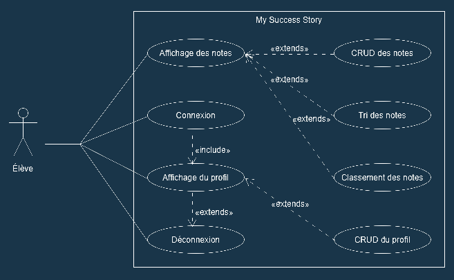
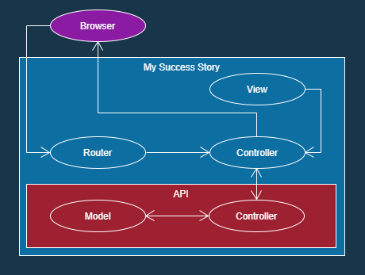
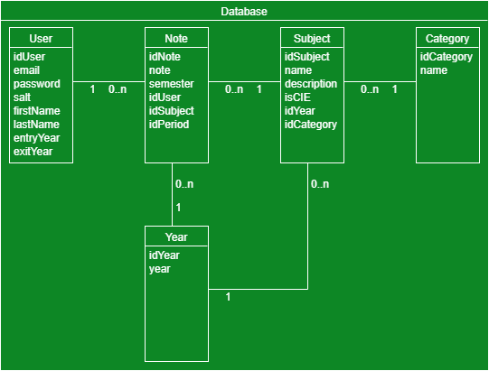

# My Success Story

## Documentation technique

### 1. Description
Le site sert aux élèves à enregistrer leurs notes et à les afficher sous forme de grille. L'élève peut ensuite les trier, calculer ses moyennes et les modifer comme bon lui semble.

Les utilisateurs doivent créer un compte ou se connecter pour utiliser le site. Pour créer un compte, l'utilisateur doit entrer une adresse email, un mot de passe, un nom et un prénom, ainsi qu'une année d'entrée au CFPT et une année de sortie s'il n'y est plus.

Après s'être connecté, le profil de l'utilisateur s'affiche et il peut modifier ses informations personnelles ou se déconnecter pour changer de compte.

Une fois connecté, l'utilisateur à accès aux notes qu'il a entrées et peut en ajouter d'autres, les modifier ou les supprimer. Quand il insère une note, il doit entrer la matière dans laquelle il l'a reçue.

Il est aussi possible de trier ses notes par catégorie ou par moyenne et les classer de la plus haute à la plus basse ou inversément.

L'utilisateur peut aussi ajouter des notes fictives non définitives pour simuler les moyennes qu'il aurait obtenues et ses résultats de fin de semestre, d'année ou de formation.



### 2. Architecture du site
Les pages du site sont séparées en MVC. Chaque fichier a une fonction particulière : les models contiennent toute la logique du site dans des fonctions quand appelle avec les controleurs. On affiche ensuite les résultats dans les vues à l'aide d'instructions "echo".

L'API du projet envoie des données brutes en JSON qui sont récupérées par le site web, qui les traitent les affichent ensuite dans le navigateur.



### 3. Base de données
Les utilisateurs ont les informations de leurs profils stockées dans la table *User*. Chaque utilisateur peut posséder des notes stockées dans la table *Note*. Chaque note est liée à une certaine matière stockée dans la table *Subject* qui fait partie d'une catégorie de la table *Category*. Les notes sont aussi liée à l' année dans laquelle elle a été obtenue dans la table *Year*.




### 5. API
##### Création d'utilisateur
    Url : /api/users
    Méthode : POST
    Entrée de données : Informations de l'utilisateur
```json
{
    "email":"example@email.com",
    "password":"example",
    "firstName": "example",
    "lastName": "example"
}
```
##### Connexion 

Les données a envoyer en json sont a mettre dans body->raw
Le token est insérer dans Authorization

    Url : /api/login
    Méthode : GET
    Entrée de données : Informations de connection de l'utilisateur
    Données recues : Le token de l'utilisateur
```json
{
    "email":"example@email.com",
    "password":"example"
}
```
##### Obtention données utilisateur
    Url : /api/users
    Méthode : GET
    Entrée de données : Token utilisateur
    Données recues : Informations de l'utilisateur
##### Modification utilisateur
    Url : /api/users
    Méthode : PATCH
    Entrée de données : Token utilisateur & Données de l'utilisateur à modifier
```json
{
    "firstName":"newName"
}
```
##### Suppression utilisateur
    Url : /api/users
    Méthode : DELETE
    Entrée de données : Token utilisateur

##### Obtention notes
    Url : /api/notes
    Méthode : GET
    Entrée de données : Token utilisateur
    Données recues : Notes de l'utilisateur
##### Ajout note
    Url : /api/notes
    Méthode : POST
    Entrée de données : Token utilisateur & Note à ajouter
    Données recues : Notes de l'utilisateur
```json
{
    "note":6,
    "semester":2,
    "idSubject":"physique",
    "idYear":3
}
```
##### Modification note
    Url : /api/notes
    Méthode : PATCH
    Entrée de données : Token utilisateur & Données de la note à modifier
```json
{
    "idNote": 2,
    "fields": "newValues"
}
```
##### Suppression note
    Url : /api/notes
    Méthode : DELETE
    Entrée de données : Token utilisateur & id de la note a supprimer
```json
{
    "idNote":2
}
```

### 5. Liens
- [Site Web](https://successstory.cfpti.ch)
- [Mandat](https://docs.google.com/document/d/16Rj2KkcCFHPPHjjAMmvoyeppWsdiO9JN/edit?usp=sharing&ouid=106752474556925767372&rtpof=true&sd=true)
- [Trello](https://trello.com/b/iweK5h2I/my-success-story)
- [GitHub](https://github.com/LAAC172003/MySuccessStory)

### 6. Logiciels utilisés
- [Visual Studio Code](https://code.visualstudio.com) - ver. 1.63.0
- [GitHub Desktop](https://github.com) - ver. 2.9.5 (x64)
- [WampServer](https://www.wampserver.com) - ver. 3.2.4.2
- [php](https://www.php.net) - ver. 7.4.9
- [Apache](https://httpd.apache.org) - ver. 2.4.46
- [phpMyAdmin](https://www.phpmyadmin.net) - ver. 5.0.2
- [MySQL](https://www.mysql.com) - ver. 5.7.31
- [Postman](https://www.postman.com) - ver.9.5.0