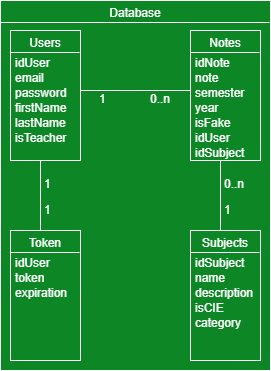

# My Success Story

## Documentation technique

### 1. Description
Le site sert aux élèves à enregistrer leurs notes et à les afficher sous forme de grille. L'élève peut ensuite les trier, calculer ses moyennes et les modifer comme bon lui semble.

Les utilisateurs doivent créer un compte ou se connecter pour utiliser le site. Pour créer un compte, l'utilisateur doit entrer une adresse email, un mot de passe, un nom et un prénom, ainsi qu'une année d'entrée au CFPT et une année de sortie s'il n'y est plus.

Après s'être connecté, le profil de l'utilisateur s'affiche et il peut modifier ses informations personnelles ou se déconnecter pour changer de compte.

Une fois connecté, l'utilisateur à accès aux notes qu'il a entrées et peut en ajouter d'autres, les modifier ou les supprimer. Quand il insère une note, il doit entrer la matière dans laquelle il l'a reçue.

Il est aussi possible de trier ses notes par catégorie ou par moyenne et les classer de la plus haute à la plus basse ou inversément.

L'utilisateur peut aussi ajouter des notes fictives non définitives pour simuler les moyennes qu'il aurait obtenues et ses résultats de fin de semestre, d'année ou de formation.


### 2. Architecture du site
Les pages du site sont séparées en MVC. Chaque fichier a une fonction particulière : les models contiennent toute la logique du site dans des fonctions quand appelle avec les controleurs. On affiche ensuite les résultats dans les vues à l'aide d'instructions "echo".

L'API du projet envoie des données brutes en JSON qui sont récupérées par le site web, qui les traitent les affichent ensuite dans le navigateur.


### 3. Base de données
Les utilisateurs ont les informations de leurs profils stockées dans la table *User*. Chaque utilisateur peut posséder des notes stockées dans la table *Note*. Chaque note est liée à une certaine matière stockée dans la table *Subject* qui fait partie d'une catégorie de la table *Category*. Les notes sont aussi liée à l' année dans laquelle elle a été obtenue dans la table *Year*.




### 5. API

Les données a envoyer en json sont a mettre dans body->raw
Le token est insérer dans Authorization avec le type Bearer Token.

#### Notes

##### Ajout note
URL : /api/notes
Méthode : POST

Paramètres : Authentification par token et nouvelle note à ajouter
```json
{
	"note" : 6,
	"semester" : 1,
	"subject" : "M100",
	"year": 1
}
```

Valeurs de retour : Note de l'utilisateur
```json
{
	"value": {
		"note": 6,
		"semester": 1,
		"idSubject": 1,
		"year": 1,
		"idUser": 1
	},
	"message": "The note has been added",
	"errorCode": ""
}
```

##### Obtention notes
URL : /api/notes
Méthode : GET

Entrée de données : Authentification par token, id de la note et paramètres facultatifs
```json
{
	"id": 1, // Valeurs possibles : Nombre (Par défaut : affiche toutes les notes)
	"sort": "Note", // Valeurs possibles : Note, Subject (Par défaut : tri par id)
	"order": "ASC", // Valeurs possibles : ASC, DESC (Par défaut : ASC)

	// Filtres
	"note": 6, // Valeurs possibles : multiple de 0.5 de 1 à 6
	"semester": 1, // Valeurs possibles : 1 ou 2
	"subject": "M100" // Valeurs possibles : nom d'une matière
}
```

Valeurs de retour : Liste des notes de l'utilisateur
```json
{
	"value": [
		{
			"idNote": 1,
			"note": 6,
			"semester": 1,
			"year": 1,
			"idUser": 1,
			"idSubject": 1
		},
		{
			"idNote": 2,
			"note": 4,
			"semester": 1,
			"year": 1,
			"idUser": 1,
			"idSubject": 1
		}
	],
	"message": "",
	"errorCode": ""
}
```

##### Modification note
URL : /api/notes
Méthode : PATCH

Paramètres : Authentification par token et nouvelles données de la note à modifier
```json
{
	"idNote": 1,
	"note": 5,
	"semester": 2,
	"year": 2,
	"idSubject": 3
}
```

Valeurs de retour : Note modifiée
```json
{
	"value": [
		{
			"idNote": 135,
			"note": 5,
			"semester": 2,
			"year": 2,
			"idUser": 1,
			"idSubject": 3
		}
	],
	"message": "The note has been edited",
	"errorCode": ""
}
```

Remarques : Seules les données renseignées seront modifiées. L'id ne peut pas être modifié.

##### Suppression note
URL : /api/notes
Méthode : DELETE

Paramètres : Authentification par token et id de la note à supprimer
```json
{
	"idNote": 1
}
```

Valeurs de retour : Message de confirmation
```json
{
	"value": null,
	"message": "The note has been deleted",
	"errorCode": ""
}
```

#### Utilisateurs

##### Création utilisateur
URL : /api/users
Méthode : POST

Paramètres : Informations de l'utilisateur
```json
{
	"email": "example@example.com",
	"password": "this is a password",
	"firstName": "myFirstName",
	"lastName": "myLastName"
}
```

Valeurs de retour : Informations de l'utilisateur
```json
{
	"value": [
		{
			"idUser": 1,
			"email": "example@example.com",
			"firstName": "myFirstName",
			"lastName": "myLastName",
			"isTeacher": 0
		}
	],
	"message": "",
	"errorCode": ""
}
```

##### Obtention données d'utilisateur
URL : /api/users
Méthode : GET

Paramètres : Authentification par token

Valeurs de retour : Informations de l'utilisateur
```json
{
	"value": [
		{
			"idUser": 1,
			"email": "example@example.com",
			"firstName": "MyFirstName",
			"lastName": "MyLastName",
			"isTeacher": 0
		}
	],
	"message": "",
	"errorCode": ""
}
```

##### Modification utilisateur
URL : /api/users
Méthode : PATCH

Paramètres : Authentification par token et nouvelles données de l'utilisateur
```json
{
	"password": "this is my new password",
	"firstName": "MyNewFirstName",
	"lastName": "MyNewLastName"
}
```

Valeurs de retour : Informations de l'utilisateur
```json
{
	"value": [
		{
			"idUser": 1,
			"email": "example@example.com",
			"firstName": "MyNewFirstName",
			"lastName": "MyNewLastName",
			"isTeacher": 0
		}
	],
	"message": "The user has been edited",
	"errorCode": ""
}
```

Remarques : Seules les données renseignées seront modifiées. L'id, l'email et la profession ne peuvent pas être modifiés.

##### Suppression utilisateur
URL : /api/users
Méthode : DELETE

Paramètres : Authentification par token

Valeurs de retour : Message de confirmation
```json
{
	"value": null,
	"message": "The user has been deleted",
	"errorCode": ""
}
```

##### Connexion
URL : /api/login
Méthode : PUT

Paramètres : Informations de connexion
```json
{
	"email": "example@example.com",
	"password": "this is a password"
}
```

Valeurs de retour : Token de l'utilisateur
```json
{
	"value": {
		"token": "someRandomLetters",
		"expiration": 3600
	},
	"message": "",
	"errorCode": ""
}
```

##### Promotion
URL : /api/promote
Méthode : PATCH

Paramètres : Authentification par token avec un compte de professeur et adresse email du compte à promouvoir
```json
{
	"email": "example@example.com"
}
```

Valeurs de retour : Message de confirmation
```json
{
	"value": null,
	"message": "The user has been promoted",
	"errorCode": ""
}
```

#### Matières

##### Création matière
URL : /api/subject
Méthode : POST

Paramètres : Authentification par token avec un compte de professeur
```json
{
	"name": "M100",
	"description": "Distinguer, préparer et évaluer des données",
	"isCIE": false,
	"category": "CFC"
}
```

Valeurs de retour : Matière créée
```json
{
	"value": [
		{
			"idSubject": 1,
			"name": "M100",
			"description": "Distinguer, préparer et évaluer des données",
			"isCIE": false,
			"category": "CFC"
		}
	],
	"message": "The subject has been added",
	"errorCode": ""
}
```

##### Obtention matières
URL : /api/subject
Méthode : GET

Paramètres : Authentification par token et année
```json
{
	"id": 1, // Valeurs possibles : Nombre (Par défaut : affiche toutes les notes)
	"name": "M100", // Valeurs possibles : Texte (Par défaut : affiche toutes les notes)

	// Filtres
	"description": "données", // Valeurs possibles : Texte
	"isCIE": false, // Valeurs possibles : booléen
	"category": "CFC" // Valeurs possibles : Nombre de 1 à 4
}
```

Valeurs de retour : Liste des matières
```json
{
	"value": [
		{
			"idSubject": 1,
			"name": "M100",
			"description": "Distinguer, préparer et évaluer des données",
			"isCIE": 0,
			"category": "CFC"
		},
		{
			"idSubject": 2,
			"name": "M114",
			"description": "Mettre en oeuvre des systèmes de codification, de compression et d'encryptage",
			"isCIE": 0,
			"category": "CG"
		}
	],
	"message": "",
	"errorCode": ""
}
```

##### Modifier matière
URL : /api/subject
Méthode : PATCH

Paramètres : Authentification par token avec un compte de professeur et nouvelles données de la matière
```json
{
	"idSubject": 1,
	"name": "M100",
	"description": "Distinguer, préparer et évaluer des données",
	"isCIE": 0,
	"category": "CFC"
}
```

Valeurs de retour : Matière modifiée
```json
{
	"value": [
		{
			"idSubject": 1,
			"name": "M100",
			"description": "Distinguer, préparer et évaluer des données",
			"isCIE": 0,
			"category": "CFC"
		}
	],
	"message": "The note has been edited",
	"errorCode": ""
}
```

Remarques : Seules les données renseignées seront modifiées. L'id ne peut pas être modifié.

##### Suppression matière
URL : /api/subject
Méthode : DELETE

Paramètres : Authentification par token avec un compte de professeur et nom de la matière
```json
{
	"name": "M100"
}
```

Valeurs de retour : Message de confirmation
```json
{
	"value": null,
	"message": "The subject has been deleted",
	"errorCode": ""
}
```

### 5. Liens
- [Site Web](https://successstory.cfpti.ch)
- [Mandat](https://docs.google.com/document/d/16Rj2KkcCFHPPHjjAMmvoyeppWsdiO9JN/edit?usp=sharing&ouid=106752474556925767372&rtpof=true&sd=true)
- [Trello](https://trello.com/b/iweK5h2I/my-success-story)
- [GitHub](https://github.com/LAAC172003/MySuccessStory)

### 6. Logiciels utilisés
- [Visual Studio Code](https://code.visualstudio.com) - ver. 1.63.0
- [GitHub Desktop](https://github.com) - ver. 2.9.5 (x64)
- [WampServer](https://www.wampserver.com) - ver. 3.2.4.2
- [php](https://www.php.net) - ver. 7.4.9
- [Apache](https://httpd.apache.org) - ver. 2.4.46
- [phpMyAdmin](https://www.phpmyadmin.net) - ver. 5.0.2
- [MySQL](https://www.mysql.com) - ver. 5.7.31
- [Postman](https://www.postman.com) - ver.9.5.0